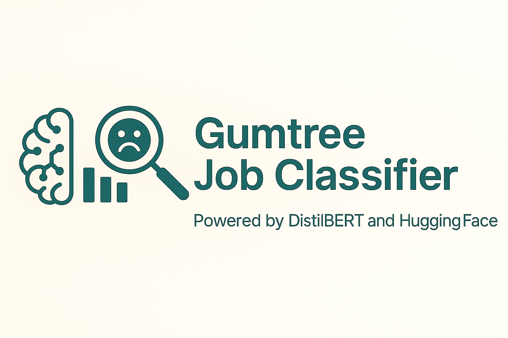

<p align="center">
  
</p>


# 🧠 Gumtree Job Classifier using Hugging Face

This project fine-tunes a `DistilBERT` model to classify job descriptions from Gumtree Australia into specific job categories. Built using Hugging Face Transformers and Datasets library.

---

## 🚀 Getting Started

### 1️⃣ Clone the Repository
```bash
git clone https://github.com/hishmaizamy/gumtree-jobclassifier-hf.git
cd gumtree-jobclassifier-hf
```

### 2️⃣ Install Dependencies
Make sure you have Python 3.8+ and run:
```bash
pip install -r requirements.txt
```

### 3️⃣ Load or Train the Model

To load existing weights:
```python
from transformers import DistilBertForSequenceClassification
model = DistilBertForSequenceClassification.from_pretrained("distilbert-base-uncased", num_labels=<num_labels>)
model.load_state_dict(torch.load("gumtree_model.pth"))
```

Or train it with:
```bash
python train_gumtree_classifier.ipynb
```

Ensure the following files are present:
- `gumtree_tokenized/`
- `label2id.json`
- `id2label.json`

---

## 🧪 Example Usage

```python
text = "We are hiring a barista for a busy cafe in Sydney CBD."
inputs = tokenizer(text, return_tensors="pt")
outputs = model(**inputs)
predicted_class = outputs.logits.argmax(dim=1).item()
print(id2label[str(predicted_class)])
```
Expected Output:
```
hospitality
```

---

## 📁 Project Structure
```
├── gumtree_tokenized/       # Pre-tokenized dataset
├── label2id.json            # Category to ID mapping
├── id2label.json            # ID to Category mapping
├── gumtree_model.pth        # Saved model weights
├── train_gumtree_classifier.ipynb
├── requirements.txt
└── README.md
```

---

## 📌 Built With
- 🐍 Python
- 🤗 Hugging Face Transformers

---

## 🔗 Connect with Me
- [LinkedIn](https://www.linkedin.com/in/hishmaizamy)
- [GitHub Portfolio](https://github.com/hishmaizamy)
